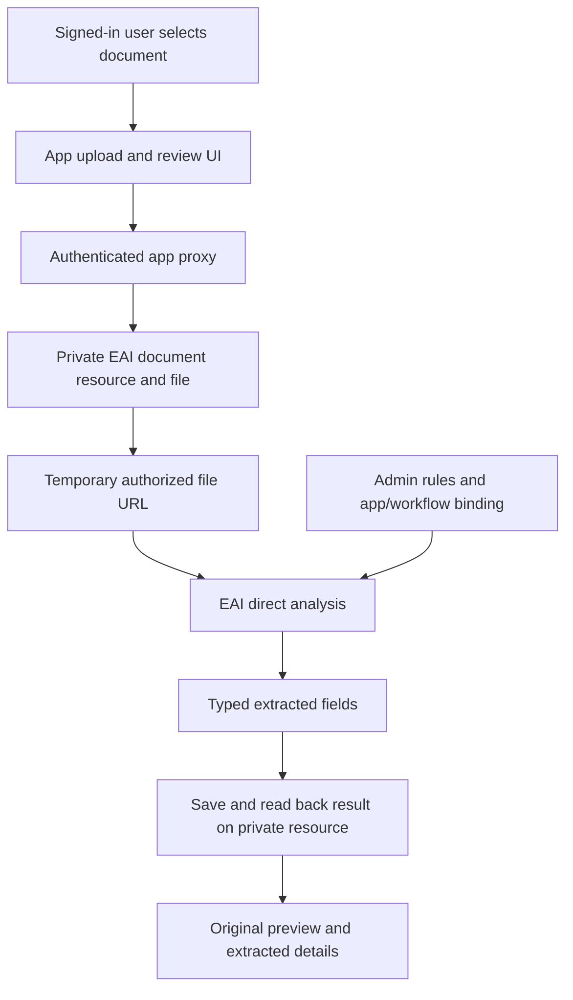

# Runbook: add Enterprise AI Content Understanding to an app

**Audience:** EAI platform teams, customer delivery teams and their AI coding agents.

**Version:** 1.0 — 28 September 2026.

**Reference outcome:** a local onboarding app uploads a synthetic driving licence to hosted EAI, extracts its number using Admin Portal rules, saves the result and displays it beside the original.

**Purpose:** document the working integration and the platform changes needed so another team can reproduce it without platform source access.

**Scope:** document upload, configured extraction, storage and review. Identity verification, onboarding approval and app deployment are separate outcomes.

## 1. Decision and current evidence

**We relied on private platform source code to discover and understand the successful integration. We have not demonstrated independent discovery by a customer agent.**

The endpoint works in the tested environment. That does not establish a complete, supported customer integration contract. EAI must confirm that contract, publish it and pass the external-agent test in Section 10.

This guide has three evidence categories:

- **Verified:** observed in the reference app on the date above.
- **Required platform change:** work EAI should implement or confirm already exists in its released customer surfaces.
- **Unverified:** a test or capability that still needs evidence.

### What passed

| Capability | Observed result |
| --- | --- |
| Synthetic PDF upload | File saved through an authenticated, user-delegated EAI resource-file call. |
| Configured extraction | `LicenceNumber` returned as `D1234567890`, confidence `0.98`. |
| Admin rules | Request selected the saved document type and used its configured analyzer; no inline extraction schema or prompt. |
| Result persistence | File and extracted fields read back from the app-owned resource. |
| Local app | Signed-in browser completed the same extraction against hosted EAI. |
| Review UI | PDF preview and extracted fields displayed together; mobile layout checked. |
| Completion handling | Extraction alone did not approve identity or complete onboarding. |

### What is not established

- Independent setup using only released documentation, CLI and SDK.
- An official support commitment for the direct-analysis integration described here.
- Live passport or image extraction in this exercise. The app accepts PDF, JPG and PNG; the live sample was PDF.
- Denial of file and result access to a second user. The resource was configured `owner_private`; that setting is not a substitute for the denial test.
- Refresh recovery in the app UI, despite saved results being available through EAI.
- Document authenticity, name/date matching, expiry validation or approval.
- The separate standalone queued business-document lifecycle.

### Source-free discovery audit

These findings describe the surfaces inspected, not every EAI release or customer environment:

| Surface checked | Finding |
| --- | --- |
| Installed CLI `3.15.8`: `eai --describe` | Advertises document upload/classification and classifier configuration. |
| `eai docs classify --help` and `eai docs upload --help` | Accept a file; help does not describe app/workflow context, saved-rule selection or the direct extraction contract. |
| Available Gofer platform reference | Names `/v4/data/documents/classify-by-url`, but does not provide the complete request schema and integration example. |
| Installed `@enterpriseaigroup/core` README | General infrastructure guidance; no complete CU integration walkthrough. This was not an exhaustive audit of every SDK distribution. |
| Advertised documentation homepage and `llms.txt` | `https://eai-tools.github.io/eai/` and its `llms.txt` returned HTTP 404 during this check. |
| Latest release verification | Registry/GitHub access was unavailable in this session. No claim is made that `3.15.8` is the latest release. |

The successful earlier investigation inspected EAI PublicAPI implementation code to resolve the request and saved-rule behavior. A customer must not need that access.

## 2. What EAI must do, in order

The table is the implementation backlog. Owners are suggested; EAI should assign accountable teams. **These changes are proposed, not already delivered by this document.**

| ID / priority | Owner | Exact change and deliverable | Acceptance criterion |
| --- | --- | --- | --- |
| CU-01 / P0 | PublicAPI + platform product | Choose and support a customer extraction contract. Confirm the existing direct route, or publish its supported replacement and migration guidance. Specify synchronous/queued behavior, persistence responsibility, authorization, limits, supported formats, timeout, retries, versioning and failure states. | An app team can determine the supported route and lifecycle without reading a router or service implementation. The documented contract matches the target deployment. |
| CU-02 / P0 | Documentation + release engineering | Restore the advertised docs URLs or redirect them to a maintained site. Publish a versioned CU quickstart, machine-readable OpenAPI, `llms.txt` discovery and a complete example. Link them from CLI help, SDK docs and Admin Portal. | Every advertised link works for a customer account with ordinary access. Documentation builds and link checks run in release CI. No private source link is required to finish the guide. |
| CU-03 / P0 | Admin Portal + PublicAPI | Add an app/workflow CU setup view. Show allowed document types, active rules, synchronization status, published classifier version, target binding and storage readiness. Reuse existing records. Export the effective integration configuration using an authorized API. | The app can discover its allowed document types and field definitions. A new agent does not guess keys, analyzer IDs or raw database fields. Editing a rule shows whether it is saved, synchronized and effective. |
| CU-04 / P0 | ResourceAPI + app provisioning | Publish a supported private document-storage recipe or provisioned template. Include schema, file property, owner authorization, storage binding, publication, runtime synchronization, result updates, readback and deletion/retention. | A fresh app provisions storage using documented operations, waits for confirmed readiness and preserves existing types. Two-user tests deny unauthorized file, link and result access. |
| CU-05 / P0 | SDK + app template | Release a typed CU client and minimal upload/review example. Cover file upload, authorized temporary access or resource references, saved-rule analysis, response validation, result persistence and errors. Include base-path/proxy setup and compatible package versions. | Installing the documented release in a fresh app is sufficient. No copied private helper, guessed JSON parser or provider credential is needed. |
| CU-06 / P0 | CLI + agent guidance | Make CU configuration discovery, readiness and an explicitly invoked synthetic extraction test discoverable in `eai --describe`, command help and the agent guide. Document exact app/workflow/type options. | The CLI gives an agent the request contract and next action. Its help, flags, schemas and deployed behavior agree. No invented commands are needed. |
| CU-07 / P0 | QA + release engineering | Run the isolated external-agent acceptance test in Section 10 against a released platform/SDK/CLI combination. Record versions and sanitized evidence. | A fresh agent completes setup, extraction, readback and failure/access checks without private source, prior troubleshooting history or undocumented staff instructions. |
| CU-08 / P1 | PublicAPI + CU service + support | Standardize actionable error responses and an authorized diagnostic export. Show stage, safe error code, retryability, configuration references, correlation ID and deployed version. | A customer can distinguish missing rules, synchronization failure, wrong binding, permission denial, file access failure, provider failure and result-save failure without cloud log access. |
| CU-09 / P1 | Admin Portal + CU service | Add “Test extraction” using the selected app/workflow/type and a synthetic file. Display typed values, confidence, effective rule/classifier versions and separate upload/extraction/save outcomes. | The same saved configuration produces equivalent results in Admin and the app. A generic health badge is never presented as extraction proof. |
| CU-10 / P1 | PublicAPI + workflow/storage teams | Either finish the separate standalone business-document lifecycle across deployed services, or clearly mark it unavailable and point to the supported direct path. | An onboarding app never needs a dummy planning application. Unsupported lifecycle selection fails before upload with a useful explanation. |

### Minimum release sequence

1. Agree CU-01 and verify it against the deployed environment.
2. Publish the contract, storage recipe and complete example: CU-02 and CU-04.
3. Ship configuration discovery, SDK/template wiring and CLI guidance: CU-03, CU-05 and CU-06.
4. Run CU-07 using only those released customer materials.
5. Fix each undocumented step revealed by that test, then rerun with a fresh agent.
6. Publish supported versions, test evidence and known limitations. Add CU-08 through CU-10 as scoped improvements.

Some deliverables may already exist in newer releases. Validate them before creating duplicate work. Documentation and SDK changes may be enough for the direct path; do not claim a backend rewrite is necessary without that assessment.

## 3. Supported contract EAI needs to publish

For each operation, publish the exact path, authentication, required scope, request/response schema, example and error codes:

| Operation | Information the customer needs |
| --- | --- |
| Discover configuration | Workspace/app/workflow scope, allowed type keys, rule fields, effective versions and readiness. |
| Create document resource | Supported object type/schema, owner assignment and initial state. |
| Upload file | Multipart field names, MIME/size limits, supported formats and file-property routing. |
| Obtain authorized read access | Permitted URL lifetime, access rules, expiry handling and server-side URL restrictions. |
| Run extraction | Saved-rule selection semantics, expected type versus detected type, response fields and terminal states. |
| Store/read result | Version conflict handling, result schema, provenance and partial-failure recovery. |
| Review original | Authorized file access, temporary-link refresh and browser preview behavior. |
| Retention/cleanup | Who may delete originals/results, retention policy and incomplete-upload cleanup. |

The contract must explain these easily missed points:

- A caller-supplied tenant, document URL or resource ID is not authorization.
- EAI must enforce file access and URL safety server-side, including SSRF protection. Client HTTPS validation is insufficient.
- A selected document type must not be presented as independent proof that the file has that type.
- A saved Admin rule may still be waiting for provider synchronization.
- Direct analysis does not automatically save a durable document assessment.
- Extraction confidence is not identity authenticity or a compliance decision.
- A timeout may leave a remote operation running. Retrying must follow documented idempotency or operation-status rules.
- Identity uploads must not be indexed into general company knowledge by default.

Do not invent a new SDK method or CLI command in customer instructions before it ships. Proposed wrappers such as “extract from an authorized resource” are design requirements, not currently verified API names.

## 4. Agent start prompt

Use this prompt once the supported documentation and releases above are available:

> Add Enterprise AI Content Understanding to this app using only the published EAI documentation, released SDK/CLI and this app repository. Do not inspect private platform repositories, backend implementations, another project's working adapter or prior troubleshooting history. Reuse the app's sign-in and authorized workspace. Discover its app/workflow document configuration through supported interfaces. Keep extraction rules in Admin Portal. Upload a synthetic file privately, run configured extraction, persist and read back typed results, and display them beside the original. Separate extraction from approval. Test missing rules, unreadable documents, failures and denied access. Record exact versions, documentation links and sanitized evidence. If a required contract is absent, report the missing information instead of guessing. Do not deploy unless separately authorized.

An agent following this runbook today can use the observed contract below as a reference. That is knowledge transferred from our investigation, not proof that the platform's existing discovery experience is sufficient.

## 5. Configure the workspace in Admin Portal

This section describes the reference setup. Navigation labels may differ by release; EAI must publish stable links for the supported version.

### A. Confirm app and service scope

1. Select the workspace that owns the app.
2. Confirm Content Understanding is available to that workspace and app.
3. Select the existing app and intended workflow.
4. Confirm the caller has the required application and document permissions.

Keep the app local if desired. The tested arrangement used local Next.js with hosted EAI. No separate app deployment or direct Azure key was needed for the successful test.

### B. Define document types and rules

Open **Document Intelligence**, then the document type's **Extraction & Generation Rules**.

| Field | First synthetic licence test |
| --- | --- |
| Document type | Drivers Licence; retain its existing key. |
| Field name | `LicenceNumber` |
| Description | Extract the licence number printed on the document. Leave it empty if missing or unreadable. |
| Method | Extract |
| Type | String |
| Active | Selected |
| Compliance Check | Leave off for this extraction-only test. |

Save and confirm analyzer synchronization succeeds. Do not add an inline replacement rule in the app to hide a synchronization failure.

The reference also had Passport with `PassportNumber`. Its key happened to be `test2`; that is workspace-specific and must not become a customer default. Later fields such as name, birth date and expiry require separate tests.

### C. Publish and associate the classifier

1. Open **Manage classifiers** and select or create the intended classifier.
2. Include the allowed document types.
3. Save and publish the intended version.
4. Confirm provider materialization succeeds.
5. Under **App & workflow targets**, associate that version with the target app/workflow.
6. Verify the effective association and permitted types through the supported configuration interface.

The reference used classifier `employee-onboarding-identity`, version 2, app `vending-machine-app` and workflow `employee-onboarding`. These are examples, not defaults.

For this direct extraction path, do not invent a planning application or assume that the separate Business documents lifecycle is enabled.

## 6. Implement the app: observed working flow

**Status: tested reference contract; EAI must confirm its supported customer status and release compatibility under CU-01.**



### Inputs to resolve

Resolve the authorized workspace, PublicAPI base, local proxy/base path, app key, workflow key and allowed document types. Keep extraction descriptions and field definitions in Admin Portal.

The reference app contains a small allowlist for its two document type keys. That is a current limitation, not the desired reusable design. CU-03 should let customer apps discover allowed keys and field definitions without editing the frontend whenever configuration changes.

### A. Provision private storage

The reference created an app-owned `OnboardingDocument` type with slug `onboarding-document`:

- Authorization: `owner_private`.
- Blob-backed `file` property and app-owned storage binding.
- Metadata: `filename`, `documentTypeKey`, `status`, `extractedFields`, `analysedAt`.

Its manifest was published and runtime schema synchronization completed. Creating the type alone did not make it immediately available. Existing published types were retained.

This is a conceptual recipe, not a portable object-type manifest. EAI must ship the validated schema and provisioning steps under CU-04. Never create guessed raw platform records to bypass publication or permissions.

### B. Upload and request temporary access

The reference app used its existing `EAIPlatformClient` resource methods:

```text
resources.create(objectType, initialMetadata)
resources.uploadFile(objectType, resourceId, fileProperty, file, options)
resources.getFileSas(objectType, resourceId, fileProperty, { expiresInSeconds: 300 })
```

The underlying resource-file operations were:

```text
POST /v4/data/resources/{tenantId}/{objectType}/{resourceId}/files/{property}
GET  /v4/data/resources/{tenantId}/{objectType}/{resourceId}/files/{property}/sas?expires_in_seconds=300
```

These method names worked in the reference app's available SDK. Availability in a fresh customer's released SDK still needs verification; CU-05 must specify a supported version and complete signatures.

Keep user tokens server-side in the authenticated app proxy. Never share the temporary URL in logs or diagnostic bundles. Obtain a fresh authorized link when necessary.

### C. Run configured extraction

The app's authenticated proxy forwards to the verified regional PublicAPI base:

```text
POST /v4/data/documents/classify-by-url
Content-Type: application/json
```

```json
{
  "documentUrl": "<temporary-authorized-file-url>",
  "tenantId": "<authorized-workspace-id>",
  "verticalKey": "<app-key>",
  "workflowKey": "<workflow-key>",
  "useCustomAnalyzer": true,
  "documentTypeCode": "<allowed-document-type-key>"
}
```

Use the app's actual proxy path and base path. Do not copy another app's workspace or credentials.

In this verified flow, `useCustomAnalyzer: true` and `documentTypeCode` select the saved document-type configuration. App/workflow scope selects the associated classifier configuration. The request sends no `analyzerId`, extraction schema, inline prompt, storage mapping or provider credential.

### D. Validate, persist and display

The observed successful response contained this subset:

```json
{
  "status": "succeeded",
  "extractedFields": [
    {
      "name": "LicenceNumber",
      "value": "D1234567890",
      "confidence": 0.98
    }
  ]
}
```

This is a sanitized observed subset, not a complete response schema. CU-01 must publish all states, supported value types and metadata.

1. Check the transport result and terminal analysis status.
2. Reject error responses and unexpected structures.
3. Read typed fields. Do not interpret OCR text or an upload receipt as extraction success.
4. Preserve missing values and valid confidence values; never fill absent fields from expected employee details.
5. Save results to the authorized document resource using its current version.
6. Read the saved result back before claiming durable completion.
7. Show the original PDF/image beside extracted fields and confidence.
8. Keep identity review and onboarding approval as separate states.

The reference implementation bounds the request and output, and does not automatically retry inference. A result-save failure is not complete success. The supported implementation should preserve enough operation information to retry storage without unnecessarily rerunning extraction.

The reference parser renders scalar values as text. It is not a complete reusable schema for nested/table extraction. CU-05 must document supported types and preserve them appropriately.

## 7. Prove the rules come from Admin Portal

Use a disposable configuration or obtain approval before changing shared rules.

1. Extract the synthetic licence with the number-only rule.
2. Record the effective configuration version and returned fields.
3. Add a second rule for a value visibly present in the synthetic sample.
4. Confirm rule synchronization and any required publication complete.
5. Repeat extraction without changing app code or sending inline rules.
6. Confirm the new field appears with the value from the document.
7. Restore the test configuration as agreed and preserve the test receipt.

This before/after test is a required acceptance gate. The earlier successful configured extraction does not establish that this complete rule-change test has already passed.

## 8. Diagnose failures without source access

| Symptom | Supported next step |
| --- | --- |
| 401 or 403 | Check sign-in, workspace membership, app permission and resource ownership. Preserve access boundaries. |
| No document type or rules | Inspect the effective app/workflow configuration and active rule list. |
| Rule saved but absent from extraction | Inspect synchronization and effective versions, then run a fresh analysis. |
| `MISSING_PLANNING_APPLICATION` from upload | Confirm which lifecycle the app called. Do not fabricate planning context. Use the supported standalone path or escalate contract/deployment mismatch. |
| HTTP 422 for lifecycle configuration | Compare deployed schema and documented supported versions. Do not write raw binding records. |
| Type created but upload cannot find it | Check manifest publication, storage provisioning and runtime schema synchronization. |
| Temporary file URL cannot be read | Check authorized file access, expiry and supported URL requirements. Do not expose the file publicly. |
| No fields, unreadable file or skipped result | Show a review/error state and inspect active rules and file quality. Never mark approval. |
| Analysis works but save fails | Report extraction and persistence separately; retry storage only under the documented concurrency contract. |
| UI refresh loses the preview | Load the saved resource and obtain authorized original-file access. Local object URLs do not survive refresh. |
| Timeout or provider error | Use the platform's correlation ID and documented retry rules; do not loop or guess provider credentials. |

CU-08 should make those checks available in customer-facing tools. Until then, explicitly report which diagnostic requires platform support.

Collect timestamp, environment, SDK/CLI versions, operation stage, sanitized request shape, status/error code, configuration versions and correlation ID. Exclude raw identity content, access tokens, cookies, provider secrets and signed URLs from shared reports.

## 9. Acceptance matrix

Record each result separately. “Not run” is not a pass.

| Test | Required evidence | Reference status |
| --- | --- | --- |
| Synthetic licence PDF | Correct configured number and valid typed response. | Passed. |
| File/result persistence | Authorized readback returns original and saved fields. | Passed. |
| Browser review | Original plus fields on desktop/mobile. | Passed. |
| Admin-only rule change | Changed rule affects fresh extraction without app changes. | Not run as a complete before/after test. |
| Synthetic passport | Correct configured passport number. | Not run. |
| JPG/PNG extraction | Correct fields from an image, not merely successful selection/preview. | Not run. |
| Missing/unreadable field | Missing/review state; no invented value or approval. | Live negative case not established. |
| Wrong document category | Explicit mismatch/review; no blind acceptance of selected type. | Not established. |
| Provider/timeout/save failures | Distinct failure states; no false completion or uncontrolled retries. | Adapter tests exist; full live matrix not established. |
| Another user/workspace | Denied original, temporary-link issuance, extraction and result access. | Not run. |
| Refresh recovery | Saved original and fields restored through authorized APIs. | Not implemented/verified in the reference UI. |
| Retention/cleanup | Only test-owned records/files removed according to policy. | Diagnostic fixture cleaned; full retention policy not tested. |
| External-agent setup | Section 10 passes with released customer surfaces only. | Not run. |

Do not use an extraction-confidence threshold alone to turn these checks into identity approval.

## 10. External-agent release gate: no platform source access

This test answers the exact concern that motivated this runbook.

### Test environment

- Use a fresh machine/container and a fresh agent conversation.
- Provide only a released EAI app template, released SDK/CLI and normal customer-level workspace access.
- Allow access to maintained customer documentation and Admin Portal.
- Use a disposable workspace/configuration and a clearly synthetic test file.
- Remove platform repository mounts, private GitHub access, cloud-operator credentials and cached private source.
- Exclude this app's working CU adapter, investigation notes and conversation history.
- Do not provide this retrospective runbook as a substitute for missing official documentation. EAI can publish its supported material, then the agent must discover that material normally.

### Give the agent this task

> Add a document upload to this app. Use EAI Content Understanding to extract the fields configured for this app/workflow in Admin Portal. Save the original and results privately, and show them together. Use the synthetic licence provided. Keep the app local. Use only supported customer interfaces and documentation. Report missing information rather than guessing.

### Observe and score

1. Can the agent discover CU and its required configuration from the normal entry points?
2. Can it find the exact supported contract, authentication and compatible package versions?
3. Can it create/reuse rules and bindings without undocumented API calls?
4. Can it provision private storage and tell when synchronization finishes?
5. Can it extract, validate, persist and read back the expected field?
6. Can it show original/results and recover the saved result after refresh?
7. Can it demonstrate the Admin-only rule change and the defined negative/access tests?
8. Can it diagnose a controlled failure using a safe error/support bundle?

Record every documentation page, tool command, request contract and human intervention. An undocumented hint from a platform engineer is a discovery failure, even if the eventual extraction succeeds.

**Pass:** the defined acceptance matrix passes using released customer materials, with no hidden implementation knowledge. Missing contracts are fixed and the test is repeated with a fresh agent. Measure time to first correct persisted extraction and number of manual interventions; establish a baseline before setting targets.

## 11. Handoff and ownership

For each CU-01 through CU-10 item, track owner, release/version, documentation URL, acceptance evidence and remaining limitation. Do not close an item merely because code merged; verify the deployed customer path.

For each customer app, hand over:

- Environment and supported SDK/CLI/platform versions.
- App/workflow and configuration record names, with private identifiers kept in approved configuration storage.
- Exact Admin changes and previous values needed for rollback.
- Object type, ownership policy, retention and schema-readiness evidence.
- Request/response contract, changed app files and acceptance results.
- Open issues and the next responsible owner.

Rollback should restore only the scoped configuration/code changes. Preserve shared rules, unrelated app types and existing employee documents. This runbook does not authorize deployment or production configuration changes.

## 12. Reference exercise material

These local links support this retrospective. They must not become prerequisites for external customers:

- [Chatbot runbook](EAI-CHATBOT-RUNBOOK.md): companion structure and chat-specific platform improvements.
- [Firstday walkthrough](FIRSTDAY-DOCUMENT-CHECK-WALKTHROUGH.md): current reference-app user steps.
- [Earlier CU setup investigation](EAI-CONTENT-UNDERSTANDING-SETUP.md): contains historical blocked-lifecycle guidance and private-source references; do not treat it as the new customer quickstart.
- [Reference app adapter](../src/lib/onboarding/direct-extraction.ts): application implementation, not a published SDK guarantee.
- [API evidence](../.specify/specs/004-employee-workflow/evidence/direct-extraction-live.json).
- [Signed-in browser evidence](../.specify/specs/004-employee-workflow/evidence/direct-extraction-browser.json).

**Completion statement:** direct extraction works in the reference app. Independent customer setup remains unverified until the source-free release gate passes.
